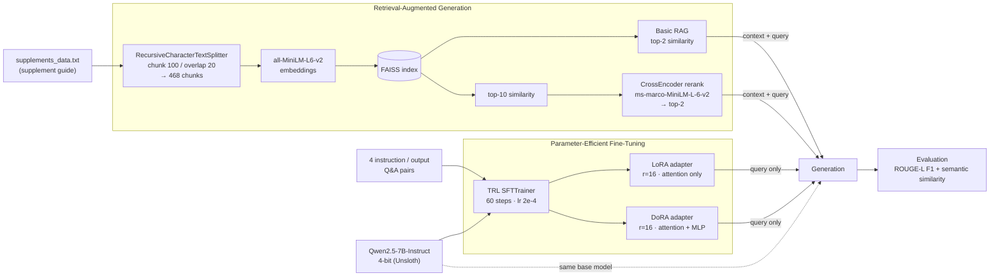

# RAG vs Fine-Tuning

A side-by-side experiment that teaches **Qwen2.5-7B-Instruct** a niche knowledge domain in two ways: by **retrieving** context at query time (RAG), or by **training** the knowledge into the weights (LoRA / DoRA fine-tuning). The outputs are then scored against a ground-truth answer.

---

## Overview

There are two common ways to give an LLM domain knowledge:

- **RAG** keeps the model frozen. Relevant chunks of a knowledge base are retrieved and placed into the prompt.
- **Fine-tuning** updates (a small part of) the model's weights so it answers from memory.

The domain here is a long-form guide to **dietary supplements**: micronutrients, fatty acids, gut health, herbal adaptogens, amino acids, antioxidants, joint health, sleep and mood. The notebook builds two RAG pipelines and two parameter-efficient fine-tunes on the same 4-bit base model. It then asks all four the same question.

## Pipeline

## Approaches compared

| Method | How knowledge reaches the model | Key settings |
|---|---|---|
| **Basic RAG** | Top-2 chunks from FAISS go into the prompt | MiniLM embeddings, `k=2` |
| **Advanced RAG** | Two-stage retrieval: top-10 vector hits, reranked by a cross-encoder, top-2 kept | `ms-marco-MiniLM-L-6-v2` reranker |
| **LoRA FT** | Low-rank adapters trained on Q&A pairs | `r=16`, `q/k/v/o_proj`, ~10.1M trainable params (0.13%) |
| **DoRA FT** | Weight-decomposed LoRA (magnitude + direction) | `r=16`, attention + `gate/up/down_proj`, ~41.8M trainable params (0.55%) |

The notebook also demonstrates **multi-query retrieval**: it searches several rephrasings of the query and de-duplicates the results. This retriever isn't used in the evaluation.

## Results

Query: *"What are the primary benefits and forms of Magnesium?"*

| Method | ROUGE-L F1 | Semantic Similarity |
|---|---:|---:|
| Basic RAG | 0.3307 | 0.7691 |
| Advanced RAG | 0.2313 | 0.8313 |
| LoRA FT | 0.6341 | 0.9196 |
| DoRA FT | **0.9041** | **0.9562** |

Training summary (Tesla T4):

| Run | Final train loss | Runtime |
|---|---:|---:|
| LoRA | 0.020 | ~2 min |
| DoRA | 0.193 | ~10 min |
