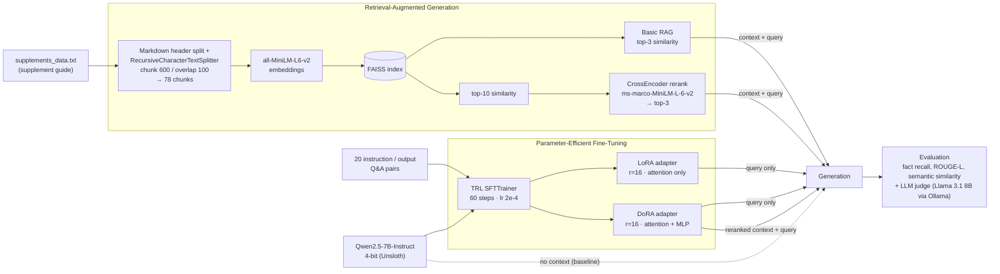

# RAG vs Fine-Tuning

A side-by-side experiment that teaches **Qwen2.5-7B-Instruct** a niche knowledge domain in two ways: by **retrieving** context at query time (RAG), or by **training** the knowledge into the weights (LoRA / DoRA fine-tuning). The outputs are then scored against a ground-truth answer.

---

## Pipeline

## Approaches compared

| Method | How knowledge reaches the model | Key settings |
|---|---|---|
| **Base (no context)** | Nothing extra; measures what the model already knows | Base model, no adapter |
| **Basic RAG** | Top-3 chunks from FAISS go into the prompt | MiniLM embeddings, `k=3` |
| **Advanced RAG** | Two-stage retrieval: top-10 vector hits, reranked by a cross-encoder, top-3 kept | `ms-marco-MiniLM-L-6-v2` reranker |
| **LoRA FT** | Low-rank adapters trained on Q&A pairs | `r=16`, `q/k/v/o_proj`, ~10.1M trainable params (0.13%) |
| **DoRA FT** | Weight-decomposed LoRA (magnitude + direction) | `r=16`, attention + `gate/up/down_proj`, ~41.8M trainable params (0.55%) |
| **DoRA FT + RAG** | DoRA model, with the Advanced RAG context added to the prompt | Same as DoRA FT and Advanced RAG |

## Results

**Overall (both buckets, 12 questions):**

| Method | Fact recall | Semantic sim | ROUGE-L | Judge correct | Judge complete | Judge faithful |
|---|---:|---:|---:|---:|---:|---:|
| Base (no context) | 0.472 | 0.763 | 0.138 | 0.958 | 0.833 | – |
| Basic RAG | **0.903** | 0.827 | 0.182 | 0.938 | 0.854 | 0.917 |
| Advanced RAG | **0.903** | 0.811 | 0.192 | **0.979** | **0.896** | 0.917 |
| LoRA FT | 0.653 | 0.789 | 0.272 | 0.833 | 0.625 | – |
| DoRA FT | 0.694 | 0.793 | 0.320 | 0.896 | 0.833 | – |
| DoRA FT + RAG | 0.889 | **0.839** | **0.374** | 0.896 | 0.729 | **0.979** |

**Fact recall by bucket:**

| Method | Paraphrased | Unseen |
|---|---:|---:|
| Base (no context) | 0.472 | 0.472 |
| Basic RAG | 0.861 | **0.944** |
| Advanced RAG | 0.861 | **0.944** |
| LoRA FT | 0.694 | 0.611 |
| DoRA FT | 0.833 | 0.556 |
| DoRA FT + RAG | **0.917** | 0.861 |

Retrieval hit rate was 1.0 for every RAG method in both buckets: the retrieved context always contained every key fact.

Takeaways:

- **RAG gets the facts right.** Basic and Advanced RAG reach about 0.90 fact recall, against 0.65–0.69 for the fine-tuned models. On unseen supplements, which fine-tuning cannot have learned, the gap is widest (0.94 vs 0.56–0.61).
- **Fine-tuning learns the answer style.** The fine-tuned models score highest on ROUGE-L, and DoRA beats the base model on paraphrased questions (0.83 vs 0.47 fact recall). On unseen supplements, DoRA's fact recall (0.556) is close to the base model's (0.472).
- **The hybrid scores well on the automatic metrics.** DoRA FT + RAG has the best paraphrased fact recall, semantic similarity, ROUGE-L and faithfulness. However, the judge rates its unseen-bucket answers as less complete (0.625).
- **The judge is lenient on correctness.** It gives the base model 0.958 correctness despite 0.472 fact recall. The base model gives plausible general answers that don't contradict the reference but leave out the specific facts. Completeness and fact recall separate the methods better.
- **LoRA is the weakest method on every judge score.** It trains only the attention layers, while DoRA also trains the MLP layers.

Training summary (Tesla T4, 20 examples, 60 steps / 20 epochs):

| Run | Loss at step 60 | Runtime |
|---|---:|---:|
| LoRA | 0.549 | ~3.5 min |
| DoRA | 0.047 | ~17 min |
